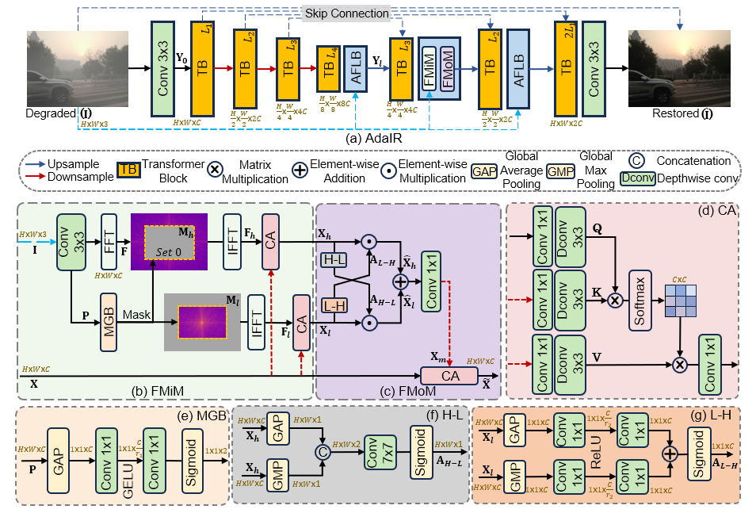
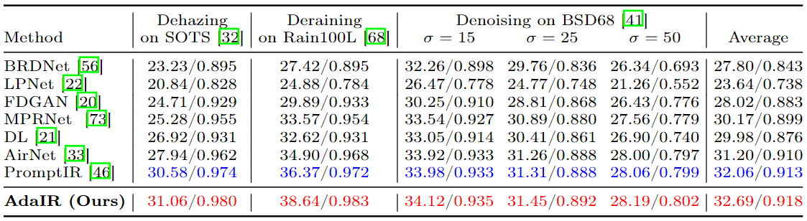
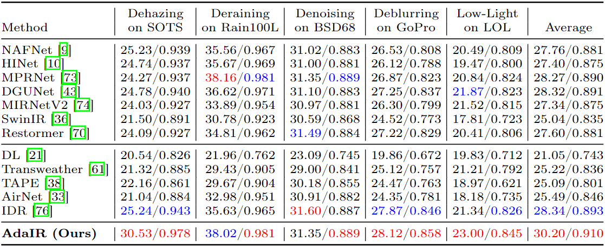

# AdaIR: Adaptive All-in-One Image Restoration via Frequency Mining and Modulation

Yuning Cui, [Syed Waqas Zamir](https://scholar.google.es/citations?user=WNGPkVQAAAAJ&hl=en), [Salman Khan](https://salman-h-khan.github.io/), [Alois Knoll](https://scholar.google.com.hk/citations?user=-CA8QgwAAAAJ&hl=zh-CN&oi=ao), [Mubarak Shah](https://scholar.google.com.hk/citations?user=p8gsO3gAAAAJ&hl=zh-CN&oi=ao), and [Fahad Shahbaz Khan](https://scholar.google.es/citations?user=zvaeYnUAAAAJ&hl=en)

[](https://arxiv.org/abs/2403.14614)
<hr />

> **Abstract:** *In the image acquisition process, various forms of degradation, including noise, blur, haze, and rain, are frequently introduced. These degradations typically arise from the inherent limitations of cameras or unfavorable ambient conditions. To recover clean images from their degraded versions, numerous specialized restoration methods have been developed, each targeting a specific type of degradation. Recently, all-in-one algorithms have garnered significant attention by addressing different types of degradations within a single model without requiring the prior information of the input degradation type. However, these methods purely operate in the spatial domain and do not delve into the distinct frequency variations inherent to different degradation types. To address this gap, we propose an adaptive all-in-one image restoration network based on frequency mining and modulation. Our approach is motivated by the observation that different degradation types impact the image content on different frequency subbands, thereby requiring different treatments for each restoration task. Specifically, we first mine low- and high-frequency information from the input features, guided by the adaptively decoupled spectra of the degraded image. The extracted features are then modulated by a bidirectional operator to facilitate interactions between different frequency components. Finally, the modulated features are merged into the original input for a progressively guided restoration. With this approach, the model achieves adaptive reconstruction by accentuating the informative frequency subbands according to different input degradations. Extensive experiments demonstrate that the proposed method, named AdaIR, achieves state-of-the-art performance on different image restoration tasks, including image denoising, dehazing, deraining, motion deblurring, and low-light image enhancement.* 
<hr />

## Network Architecture
 

## Installation and Data Preparation

See [INSTALL.md](INSTALL.md) for the installation of dependencies and dataset preperation required to run this codebase.

## Training

After preparing the training data in ```data/``` directory, use 
```
python train.py
```
to start the training of the model. Use the ```de_type``` argument to choose the combination of degradation types to train on. By default it is set to all the 5 degradation tasks (denoising, deraining, dehazing, deblurring, enhancement).

Example Usage: If we only want to train on deraining and dehazing:
```
python train.py --de_type derain dehaze
```

## Testing

After preparing the testing data in ```test/``` directory, place the mode checkpoint file in the ```ckpt``` directory. The pre-trained model can be downloaded [here](https://drive.google.com/drive/folders/1x2LN4kWkO3S65jJlH-1INUFiYt8KFzPH?usp=sharing). To perform the evaluation, use
```
python test.py --mode {n}
```
```n``` is a number that can be used to set the tasks to be evaluated on, 0 for denoising, 1 for deraining, 2 for dehazing, 3 for deblurring, 4 for enhancement, 5 for three-degradation all-in-one setting and 6 for five-degradation all-in-one setting.

Example Usage: To test on all the degradation types at once, run:

```
python test.py --mode 6
```
<!-- 
## Demo
To obtain visual results from the model ```demo.py``` can be used. After placing the saved model file in ```ckpt``` directory, run:
```
python demo.py --test_path {path_to_degraded_images} --output_path {save_images_here}
```
Example usage to run inference on a directory of images:
```
python demo.py --test_path './test/demo/' --output_path './output/demo/'
```
Example usage to run inference on an image directly:
```
python demo.py --test_path './test/demo/image.png' --output_path './output/demo/'
```
To use tiling option while running ```demo.py``` set ```--tile``` option to ```True```. The Tile size and Tile overlap parameters can be adjusted using ```--tile_size``` and ```--tile_overlap``` options respectively. -->


## Results
Performance results of the AdaIR framework trained under the all-in-one setting.

<details>
<summary><strong>Three Distinct Degradations</strong> (click to expand) </summary>

 
</details>
<details>
<summary><strong>Five Distinct Degradations</strong> (click to expand) </summary>

 
</details><br>

The visual results can be downloaded [here](https://drive.google.com/drive/folders/1lsYFumrn3-07Vcl3TZy0dzMMA9yDTpSK?usp=sharing).

<!-- The visual results of the AdaIR model evaluated under the all-in-one setting can be downloaded [here](https://drive.google.com/drive/folders/1Sm-mCL-i4OKZN7lKuCUrlMP1msYx3F6t?usp=sharing) -->


## Citation
If you use our work, please consider citing:
~~~
@misc{cui2024adair,
      title={AdaIR: Adaptive All-in-One Image Restoration via Frequency Mining and Modulation}, 
      author={Yuning Cui and Syed Waqas Zamir and Salman Khan and Alois Knoll and Mubarak Shah and Fahad Shahbaz Khan},
      year={2024},
      eprint={2403.14614},
      archivePrefix={arXiv},
      primaryClass={cs.CV}
}
~~~


## Contact
Should you have any questions, please contact yuning.cui@in.tum.de


**Acknowledgment:** This code is based on the [PromptIR](https://github.com/va1shn9v/PromptIR) repository. 

